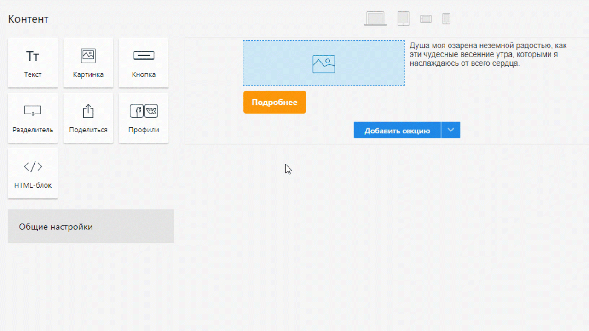

# Как создать письмо в блочном редакторе
Блочный редактор — это визуальный конструктор, в котором письма можно собирать из разных элементов (картинки, текст, кнопки). 

Создание рассылки в блочном редакторе проходит в пять этапов:

## 1. Выберите шаблон
Все письма в блочном редакторе можно создать с нуля или на основе шаблонов. Шаблоны бывают двух видов:

**Базовые** — это заготовки из элементов, которые расположены на странице в соответствии с типом рассылки: приветственное письмо, каталог товаров, оповещения, акции, новости и письмо подтверждения (последний доступен только в разделе **Контент**).

**Тематические** — это макеты с готовым дизайном. Вам нужно только подставить текст, контакты и логотип бренда.

Кроме того, любое письмо можно сохранить как шаблон — он будет храниться в разделе **Контент**. Чтобы сделать рассылку по своему шаблону, при создании письма откройте вкладку «Избранное» в левом столбике.

  

## 2. Добавьте секции
Письма состоят из секций, у которых можно задать следующие настройки:
- стиль — цвет или картинка на фон (можно установить на всю ширину секции и отдельно для блока контента по центру),
- персонализация — видимость секции для получателей: её можно показать не всем, а только определённому типу подписчиков,
- колонки — в секции может быть максимум четыре колонки, у каждой регулируются размеры и отступы.

[Как персонализировать рассылку](/docs/email-campaigns/personalization/how-to-personalize-campaign.md)  

Чтобы открыть настройки, просто нажмите на секцию. При этом справа появятся три иконки, чтобы переместить, скопировать или удалить секцию:

  
## 3. Добавьте элементы
Всего в редакторе семь элементов:
- текст,
- картинки,
- кнопки,
- разделитель (визуально отбивает секции друг от друга),
- кнопка «Поделиться» (для фейсбука, твиттера и ВКонтакте),
- профили в соцсетях,
- HTML-блок.

Чтобы добавить элемент, перетащите его в нужную секцию, а чтобы удалить — в корзину (она появится в левой части экрана, если нажать на элемент в письме и удерживать левую кнопку мыши).

  
У каждого элемента можно задать индивидуальные параметры — для этого нужно нажать на него, и в левой части экрана появится окно настроек.

  
:::tip Важно
Ошибки в вёрстке в HTML-блоке могут поломать отображение всего остального.
:::
## 4. Задайте настройки письма
В общих настройках можно установить цвет текста, ссылок и кнопок, а также фон письма. Обратите внимание: фон письма выравнивается не по центру, а по левому краю, так как не все почтовые клиенты умеют его центрировать. Установить его по центру можно только в настройках секции (во вкладке «Стили»).

  
## 5. Проверьте письмо в режиме предпросмотра
В режиме предпросмотра можно посмотреть, как письмо будет выглядеть на разных экранах (на компьютере, планшете и смартфоне), а также проверить, работают ли персонализация и функции PROScript (если они есть). Чтобы открыть предпросмотр, нажмите на иконку любого гаджета в верхней части редактора и выберите слева режим:
- посмотреть письмо для подписчиков, у которых нет данных для персонализации,
- посмотреть письмо с данными конкретного подписчика (нужно ввести его адрес),
- посмотреть все настроенные варианты персонализации. 

  
Помните, что все почтовые клиенты немного по-разному отображают письма. Если вы хотите точно знать, как подписчики увидят вашу рассылку, заведите ящики на основных доменах (Яндекс, Mail, Gmail, Outlook) и отправьте себе несколько тестовых копий. На бесплатных аккаунтах можно отправить только одну тестовую копию — на почту, на которую зарегистрирован аккаунт.