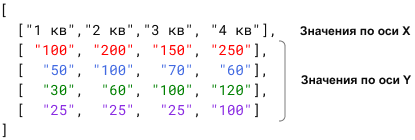
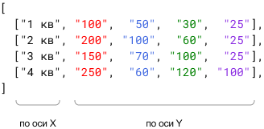
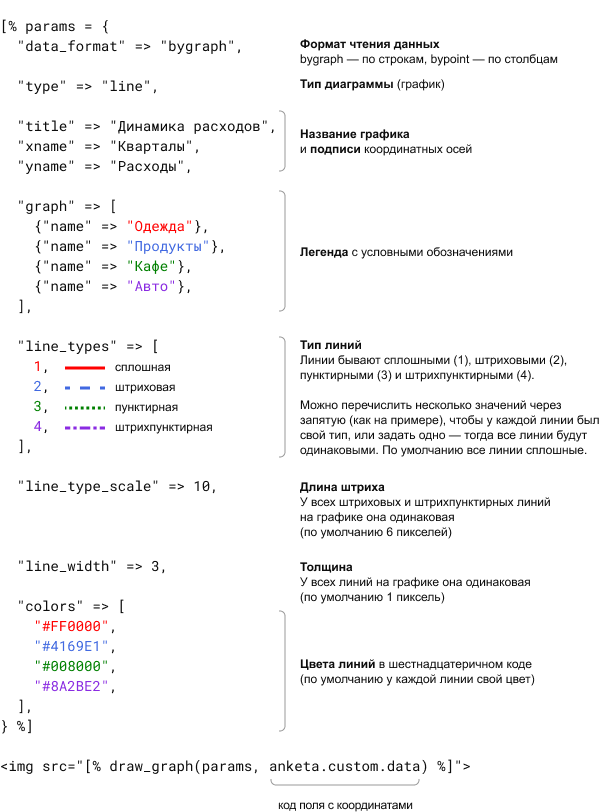

# Как вставить график в письмо
График генерируется на основе данных подписчика и представляет собой одну или несколько ломаных линий на координатной плоскости. Для примера рассмотрим график, который показывает динамику расходов по разным категориям:

 <br/>

График создаётся в три этапа:

## 1. Создайте поле для хранения координат
Все данные для графика должны храниться в одном поле, поэтому первым делом нужно его создать:
1. В разделе **Подписчики → Анкеты** откройте любую анкету и нажмите «Добавить поле». Обратите внимание, что в системной и базовой анкетах нельзя создавать поля, а в дополнительной анкете мы рекомендуем хранить поля только для социально-демографических данных.
2. Введите название поля, выберите тип «Свободный ввод» и нажмите «Добавить».

Когда поле появится в анкете, скопируйте себе код справа от него — он выглядит вот так: `[% anketa.custom.data %]`. Его нужно будет указать при добавлении графика в письмо.

## 2. Импортируйте координаты для графика
Есть два формата записи координат (для наглядности значения каждой линии выделены тем же цветом, что и сама линия на графике):

**Запись по строкам (формат bygraph)**

 <br/>

**Запись по столбцам (формат bypoint)**

 <br/>

Запомните, какой формат вы выбрали (bygraph или bypoint), — его нужно будет указать при добавлении графика в письмо. У всех получателей графика координаты должны быть записаны в одном формате. На внешний вид графика формат не влияет — дело только в удобстве.
:::tip Важно
Так как запись занимает несколько строк, данные в поле анкеты нужно загружать только через API. При импорте через интерфейс значения соберутся в одну строку, и при создании графика возникнет ошибка.

[Как импортировать данные через API](https://sendsay.ru/api/api.html#C%D0%BE%D0%B7%D0%B4%D0%B0%D1%82%D1%8C-%D0%BF%D0%BE%D0%B4%D0%BF%D0%B8%D1%81%D1%87%D0%B8%D0%BA%D0%B0-%D0%9E%D0%B1%D0%BD%D0%BE%D0%B2%D0%B8%D1%82%D1%8C-%D0%B4%D0%B0%D0%BD%D0%BD%D1%8B%D0%B5-%D0%BF%D0%BE%D0%B4%D0%BF%D0%B8%D1%81%D1%87%D0%B8%D0%BA%D0%B0-%D0%9A%D0%94)
:::

Если у конкретного получателя недостаточно данных, график будет отрисован из того, что есть. Если у подписчика данных совсем нет, то письмо ему отправится без графика.

## 3. Добавьте график в письмо
Чтобы вставить график, нужно в HTML-код выпуска вставить фрагмент кода с настройками графика и функцией PROScript. Ниже мы сначала объясним на картинке, за какие настройки отвечают разные строки кода, а ниже дадим код целиком, чтобы его можно было скопировать в письмо.

Для наглядности значения каждой линии выделены тем же цветом, что и сама линия на графике.

 <br/>

Код для копирования:
```
[% params = {
   "data_format" => "bygraph",
   "type" => "line",
   
   "title" => "Динамика расходов",
   "xname" => "Кварталы",
   "yname" => "Расходы",

   "graph" => [

      {"name" => "Одежда"},
      {"name" => "Продукты"},
      {"name" => "Кафе"},
      {"name" => "Авто"},

   ],

   "line_types" => [
     1,
     2,
     3,
     4,
   ],

   "line_type_scale" => 10,

   "line_width" => 3,

   "colors" => [
      "#FF0000",
      "#4169E1",
      "#008000",
      "#8A2BE2",
   ],
} %]


```

Перед отправкой выпуска проверьте, как график отображается в письме:
1. В HTML-редакторе нажмите на иконку любого устройства (под адресной строкой браузера) — откроется режим предпросмотра, который показывает, как будет выглядеть письмо на разных устройствах.
2. Выберите в столбике слева пункт «Посмотреть письмо с данными конкретного подписчика», введите почту любого подписчика и нажмите «Применить».