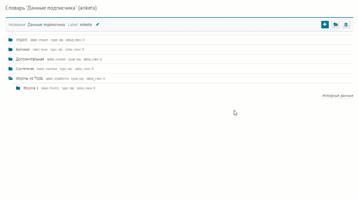
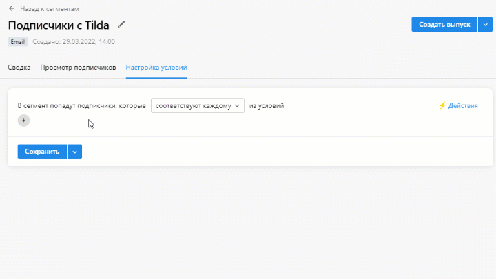
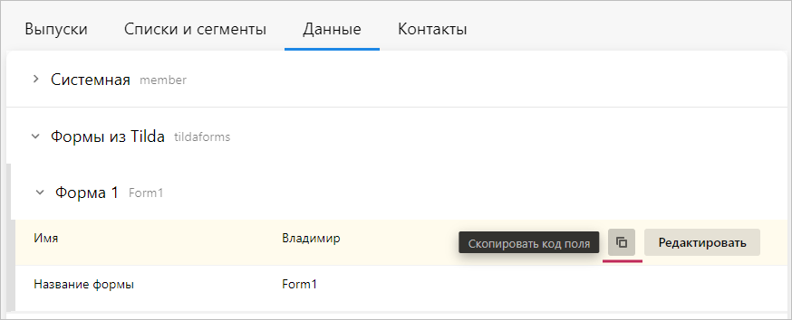

# Как использовать данные из Tilda в рассылках и сегментах
Чтобы строить сегменты и персонализировать рассылки на основе данных из Tilda, нужно сначала настроить интеграцию с Tilda.

Интеграция с Tilda (ссылка)

После интеграции все данные из форм, кроме почты, можно посмотреть только в предыдущем интерфейсе. Чтобы можно было строить сегменты и вставлять данные из Tilda в рассылки, нужно сначала настроить отображение данных в новом интерфейсе.

## Как настроить отображение данных из формы Tilda в новом интерфейсе
### 1. Создайте анкету для данных из Tilda
Анкета — это набор полей, в которых хранятся персональные данные подписчиков. Для данных из Tilda нужна отдельная анкета. Этот шаг нужно выполнить один раз — даже если потом у вас будут добавляться новые формы или сайты на Tilda.

1. Перейдите [в предыдущий интерфейс](https://sendsay.ru/account/).
2. Откройте раздел **Система → Словари** и в списке словарей нажмите «anketa».
3. В открывшемся словаре нажмите на плюсик («Создать узел»).
4. Укажите следующие данные:
    - вместо «Строка» выберите «Объект»,
    - введите название анкеты (например, «Формы из Tilda»),
    - в поле label введите tildaforms.
5. Нажмите «Добавить».

 <br/>

### 2. Создайте папку для каждой формы
Для всех форм нужно создать папки в анкете, чтобы данные не перемешивались.

1. Наведите мышку на папку «Формы из Tilda» — в правой части строки появится кнопка «+ Узел». Нажмите на неё.
2. Укажите следующие данные:
    - вместо «Строка» выберите «Объект»,
    - введите название папки (например, «Форма 1»),
3. В соседней вкладке откройте раздел **Подписчики → Группы** и выберите список с подписчиками из Tilda.
4. Нажмите «Показать всех подписчиков» и откройте карточку любого подписчика.
5. Перейдите в раздел **Данные**. В блоке «Произвольные данные» раскройте секцию tildaforms и нажмите на нужную форму. Скопируйте код формы из поля formname. Не закрывайте эту вкладку, она ещё понадобится.
6. Вернитесь на первую вкладку к созданию папки. В поле label вставьте код формы.
7. Нажмите «Добавить».

 <br/>

### 3. Создайте поля для данных из формы
Чтобы создать поле, наведите мышку на папку «Форма 1» — в правой части строки появится кнопка «+ Узел». Нажмите на неё. Для каждого поля нужно указать название и вставить переменную поля в поле label. В конце нажмите «Добавить».

 <br/>

Чтобы скопировать переменные, снова откройте соседнюю вкладку — они находятся в левом столбце. Рекомендуем создать в папке поля для всех полей из формы, кроме почты (она и так отображается в новом интерфейсе). Также советуем добавить поле с названием формы (formname), так как по нему можно отбирать подписчиков в сегмент. Поля для служебных данных (formid и tranid) можно не создавать.

 <br/>

После настройки вся информация появится в карточках подписчиков, которые пришли из Tilda, во вкладке **Данные**:

 <br/>

## Как создать сегмент
Для примера создадим сегмент для подписчиков, у которых есть любые данные из формы на Tilda.

1. Зайдите в раздел **Подписчики → Сегменты** и создайте сегмент. В поле «Тип» укажите «Email» для почты.
2. Добавьте условие:
```
имеет данные → Формы из Tilda → Форма 1 → Название формы → равно → название
```
3. Сохраните сегмент.

 <br/>
## Как вставить данные в письмо
### 1. Скопируйте код поля
1. Откройте список, куда импортировались данные из Tilda, и нажмите на любого подписчика.
2. В карточке подписчика во вкладке **Данные** и раскройте блок **Формы из Tilda**.
3. Раскройте нужную форму и наведите курсор на поле, чей код хотите скопировать. Справа появится иконка из двух квадратиков — нажмите на неё. Для примера скопируем имя подписчика:

 <br/>

### 2. Вставьте код поля в письмо
Добавьте скопированный код в текст рассылки — данные автоматически подставятся в письмо. Помните, что не у всех получателей есть нужные данные — например, те подписчики, у которых не заполнены имена, увидят пропуск в предложении. Чтобы этого избежать, можно прописать несколько вариантов приветствия в зависимости от того, заполнено у подписчика поле или нет. Для этого добавьте в письмо следующий код:
```
[% IF код поля %] Здравствуйте, [% код поля %]!
[% ELSE %] Здравствуйте!
[% END %]
```
У фрагмента с кодом можно менять шрифт, цвет и размер, чтобы форматирование всех вариантов подходило под остальное письмо.

 <br/>
### 3. Проверьте письмо в режиме предпросмотра
Рекомендуем всегда проверять перед выпуском, правильно ли работают команды PROScript. Это можно сделать в режиме предпросмотра:
1. Нажмите на любую иконку с изображением гаджетов в верхней части редактора.
2. Слева выберите режим предпросмотра «Посмотреть письмо с данными конкретного подписчика».
3. Впишите адрес подписчика, который пришёл из Tilda, и нажмите «Применить». Если у вас указаны несколько вариантов текста, советуем проверить отображение всех вариантов.